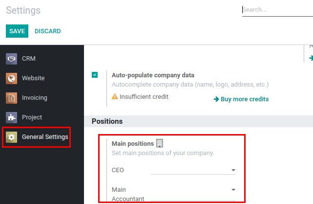

=============================
Main Positions of the Company
=============================

Define Chief Executive Officer (CEO) and Main Accountant of the company.

Configuration
=============

For this feature to work, module :code:`base_company_main_positions`
must be installed.

Set Main Positions
==================

Set *CEO* and *Main Accountant* in Positions section of General
Settings.

.. note::
    Values set here are company-specific.

.. note::
    Main positions are also used in some of financial reports, e.g.
    Debt Reconciliation Act, Debt Turnover Journal and etc.
