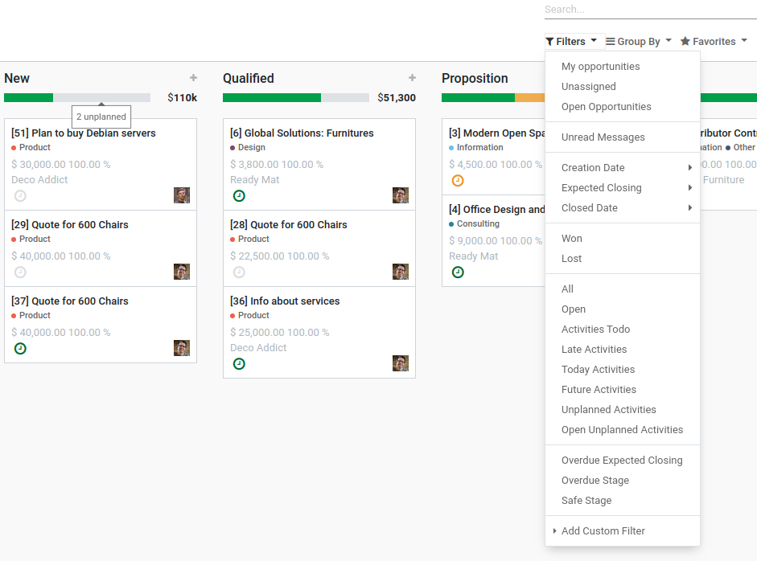

==============================
CRM Activity Unplanned Filters
==============================

Filter opportunities using Unplanned Activities and Open Unplanned
Activities filters. Opportunities without any activity are assumed as
unplanned opportunities and are displayed in gray in kanban progress
bar.

Configuration
=============

For these filters to appear, :code:`crm_activity_unplanned_filters` must
be installed.

.. note::
    Module :code:`mail_activity_unplanned` will be installed
    automatically, because it adds an extra activity state
    ``'Unplanned'``.
