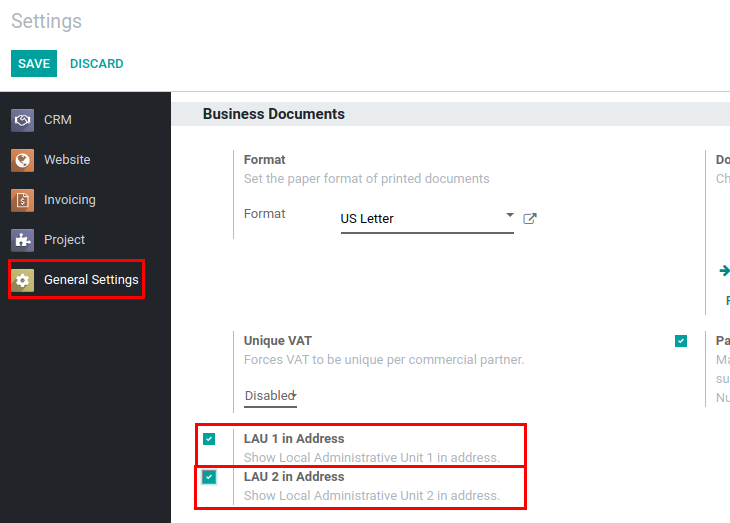
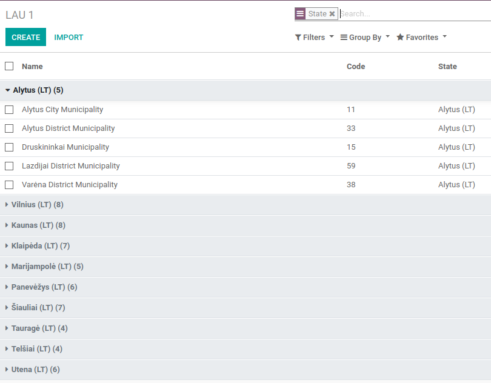
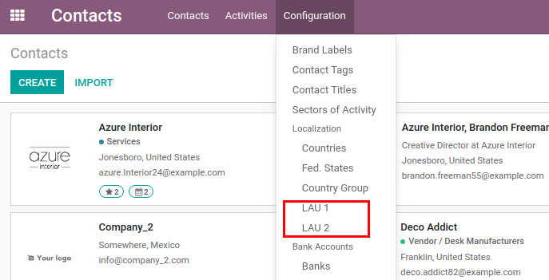
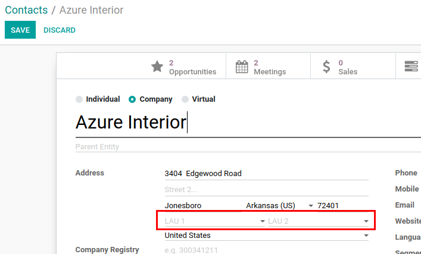
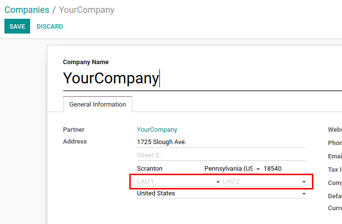
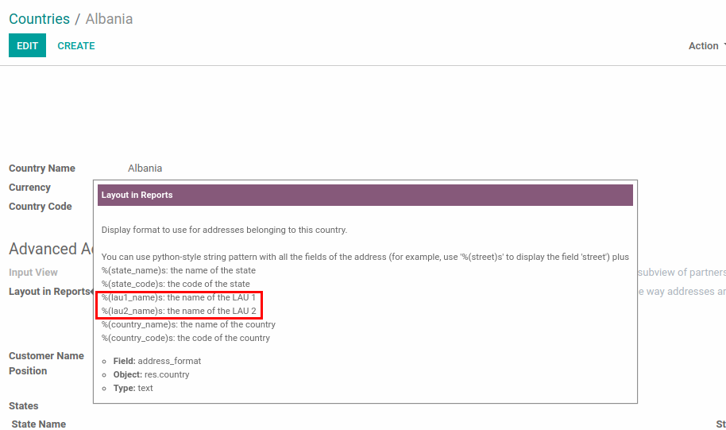

===========================================
Local Administrative Units (LAU) in Address
===========================================

Specify more detailed addresses for partners and companies.

Configuration
=============

For this feature to work, module :code:`base_address_lau` must be
installed and *LAU 1 in Address* and/or *LAU 2 in Address* in Business
Documents section of General Settings must be enabled.

.. note::
    Module :code:`base_address_lau_menus` will be installed
    automatically to display corresponding menu items.

.. tip::
    If there is a need to load data with the main counties (largest
    unit) and municipalities (LAU 1 middle unit) of Lithuania, module
    :code:`l10n_lt_administrative_units` should be installed.

    Example of data that will be loaded:

LAU 1 & LAU 2
=============

When partner or company address must include more detailed information
and standard country states are not enough to do so, local
administrative units (LAU) can be used. Two more LAU levels are added:

* LAU 1 (district or municipality in some countries etc.) is a
  subdivision of an existing unit State (``res.country.state``).
* LAU 2 (municipality or eldership in some countries) is a subdivision
  of LAU 1.

Valid rule of dependencies: Country > State > LAU 1 > LAU 2.

Setup LAU 1 & LAU 2
===================

LAU 1 and LAU 2 can be reached and configured via corresponding menus:
:menuselection:`Contacts --> Configuration --> Localization --> LAU 1`
and
:menuselection:`Contacts --> Configuration --> Localization --> LAU 2`.

LAU 1 & LAU 2 in Address
========================

Currently, LAU 1 and LAU 2 can be set in address on partner:

or company:

LAU 1 and LAU 2 can also be used in address format of the country.

