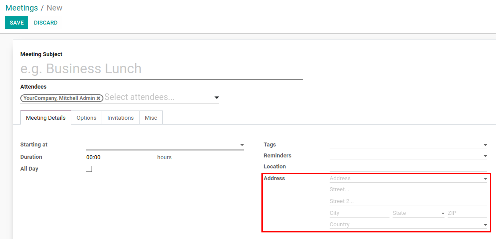

=======================================
More Detailed Address in Calendar Event
=======================================

Define more detailed location address for calendar event.

Configuration
=============

For this feature to work, module :code:`calendar_address` must be
installed.

Address of Event
================

*Address* section is added to include more detailed information about
the address of event.

Auto Fill
=========

Select a partner address in the field with placeholder *Address* to auto
fill all address fields with data from selected partner. This will also
concatenate all values from address fields and insert it into *Location*
field.

.. note::
    Address from *Location* field is still used while synchronizing
    calendar events and it's a standard Odoo behavior.
