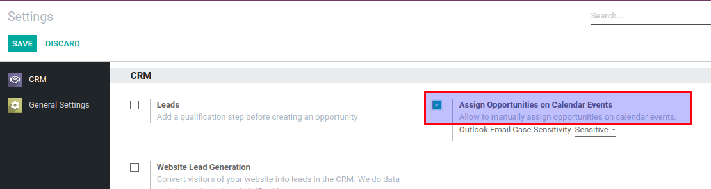
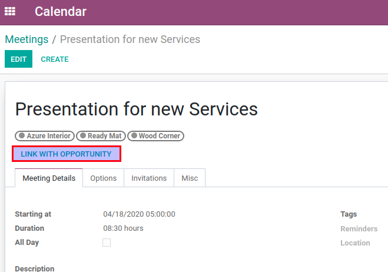
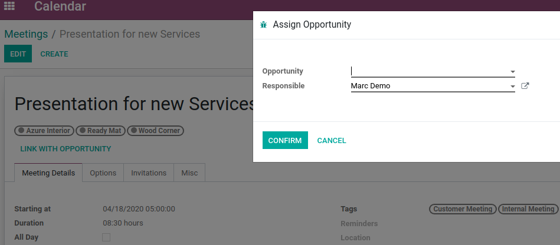
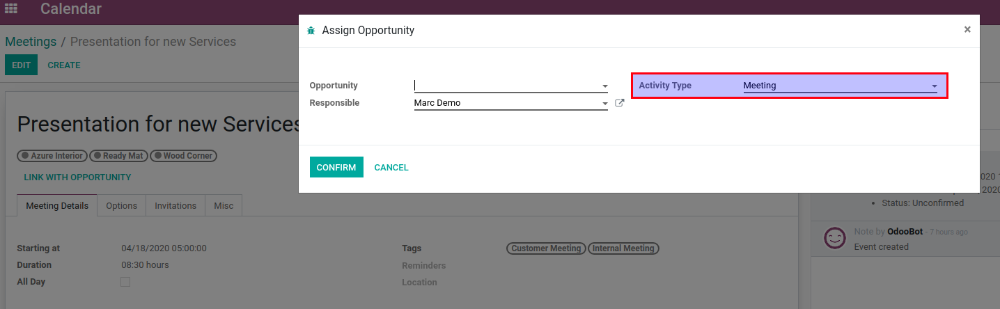
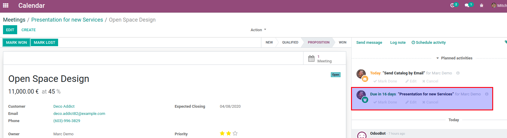

=======================================
Assign Opportunities in Calendar Events
=======================================

Manually assign Opportunities in calendar event.

Configuration
=============

For this feature to work, module :code:`crm_calendar_opp_assign` must be
installed and  *Assign Opportunities on Calendar Events* in CRM Settings
must be enabled.

.. note::
    *Outlook Email Case Sensitivity* is available with batch of
    Office 365 modules and module
    :code:`office365_crm_calendar_opp_assign` must be installed.
    This option is meant to define whether lower/upper cases are
    important during Office Owner Email and Odoo User Login mapping.

Prepare to Link with Opportunity
================================

Users with minimal CRM access rights
(*Sales / User: Own Documents Only*) are able to link calendar events
with opportunities by clicking on *Link with Opportunity* button in
calendar event form view.

Following wizard will be popped up and user will be able to fill in
additional information before confirming.

*Responsible* is defaulted from active calendar event or is set to
current user.

.. note::
    When Office 365 modules are used, *Responsible* is defaulted by
    *Outlook Owner Email*.

User will be allowed to choose only from those opportunities where
*Owner* or *Responsible* is the same as selected *Responsible* in
wizard. Keep in mind, that user might not have access to all
opportunities and in such case, list of available opportunities will be
empty.

.. note::
    If there are more than one available meeting activity type, user
    will also be allowed to choose which one to use.

Link with Opportunity
=====================

By clicking on *CONFIRM*, opportunity will be assigned to currently
active calendar event and opportunity related activity will be created.
Moreover, *Responsible* will also be updated in calendar event, if
different user was selected in wizard.

.. note::
    Calendar Event might be linked with opportunity only once!
