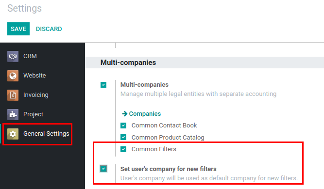

===========================
Multi-Companies Environment
===========================

Manage which company owns tags, lost reasons, filters and etc. or are
they common for all companies?

Configuration
=============

For CRM features to work properly in multi-companies environment, these
modules should be installed:

* :code:`crm_multicompany` - enables multi-companies management for Lead
  Tags and Lost Reasons, makes *Company* field visible in opportunity
  view (it is hidden in standard Odoo).
* :code:`mail_activity_multicompany` - access of activities is managed
  depending on company set on related record. If company changes on
  related record, record related activities are automatically updated
  to have the same company as on record.
* :code:`mail_activity_history_multicompany` - adds the same
  multi-companies management for activity history records as in
  :code:`mail_activity_multicompany`. See more:
  :doc:`../../discuss/customizations/mail_activity_history`.
* :code:`partner_multicompany` - enables multi-companies management for
  Partner Tags.
* :code:`ir_filters_multicompany` - adds multi-companies management on
  filters and option *Common Filters* in General Settings allows to
  additionally manage whether filters should be common between companies
  or not. Also, if *Set user's company for new filters* option is
  enabled - user's company will be set automatically on new filters.

.. tip::
    Company field on records are displayed when *Multi-companies* in
    Multi-companies section of General Settings is enabled.

.. image:: media/crm_multicompany_conf.png
    :align: center

Multi-Companies Access Rule
===========================

If Multi-companies management is enabled on a certain model, in most of
cases, user will be able to access global (where *Company* on record is
not set) or his company related records (including records from child
companies).

.. note::
    Multi-companies rules are combined together with other global and
    group-specific rules.
