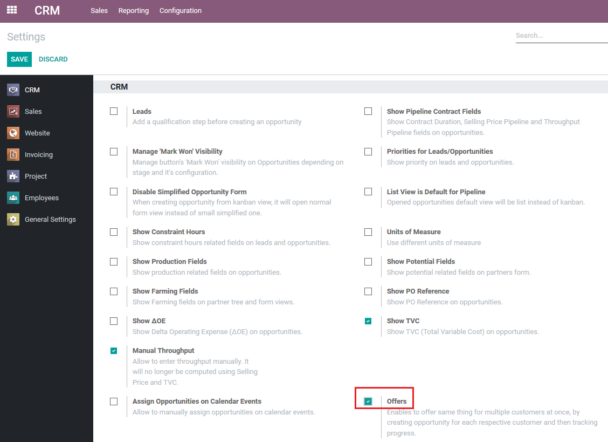

=====================================
CRM Offers 
=====================================

Enables to offer same items for multiple customers at once, 
by creating opportunity for each respective customer and then 
tracking progress. Extremely usefull functionality in sale situations.

Configuration
=============

For this feature to work, module :code:`crm_offer` must be installed.

.. note::
    This module requires CRM App to be installed.

To enable this functionality, go to
:menuselection:`CRM --> Configuration --> Settings` 
and mark Offers:

Functionality
=============

When module is installed and enabled, offers might 
be found at :menuselection:`CRM --> Sales --> Offers` 

To start using offers, a new offer must be created, adding 
Name, Salesperson, Sales process and Mode information:

.. note::
    Marking *Single Opportunity Win* will enable functionality 
    where the first won opportunity will make other opportunities 
    loose. Please select *Lost Reason* at once!

Having new offer created, offer lines must be added via 
:menuselection:`CRM --> Sales --> Offers --> Actions --> Create Offer Lines`, 
where customers and offer lines are filled:

Having done this, for every company selected, new opportunities 
are created with every product, quantities and price, listed in offer:

Any changes in opportunity will be reflected in the corresponding 
offer and this way it is possible to monitor, control and track progress 
from one place all the opportunities of the offer:

Integration with Sales module 
=============================

For this feature to work, module :code:`crm_offer_sale` must be installed.

.. note::
    This module requires CRM and Sales Apps to be installed.

This module extends CRM Offers with sales functionality where sale order 
lines will be used as offer lines, instead of using offer lines on opportunity 
directly.

Having module installed, select Opportunities & Sale Orders in *Mode* selection:

.. note::
    Please note, that in this case, products in offer lines are added from 
    your product list with all the binding product information. Sale price 
    and quantity must be entered manually.

Opportunities are created, same as before:

But in sales integration, offers are managed via quotations, not via 
opportunities offer lines:

.. note::
    Please note, that only one sales order is allowed with one opportunity. 
    This is because Sales price, TVC, Throughput and other calculations might 
    become irrelevant if more sales orders allowed.
