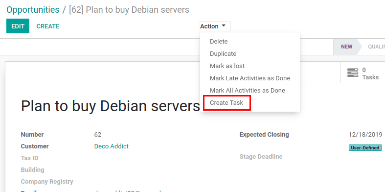
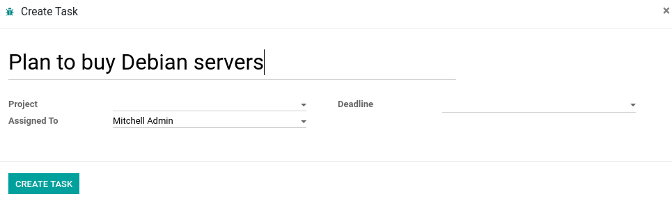
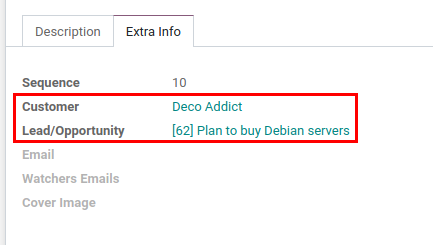
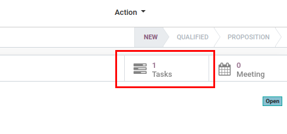

=====================================
Tasks from Leads/Opportunities
=====================================

Create project tasks from leads or opportunities and easily navigate
between them.

Configuration
=============

For this feature to work, module :code:`crm_task` must be installed.

.. note::
    This module requires CRM and Project Apps to be installed.

.. note::
    Do not confuse this module with :code:`crm_project`. That module
    converts lead to task, marking lead inactive and transferring all
    messages from lead to task. This module keeps lead/opportunity
    intact without modifying it after task is created.

Create Tasks from Leads/Opportunities
=====================================

Open lead/opportunity form view or select one from the list and choose
*Create Task* from the *Action* menu on the top.

Following wizard will be popped up and user will be able to fill in
additional information before task creation.

By clicking on *CREATE TASK*, a new lead/opportunity related task will
be created and user will be linked to it. Will also set partner on task
if there is one specified on lead/opportunity.

Track Tasks on Leads/Opportunities
==================================

There is a smart button in a form view of leads/opportunities which
shows how many tasks are related with current lead/opportunity and opens
them when clicked on it.

