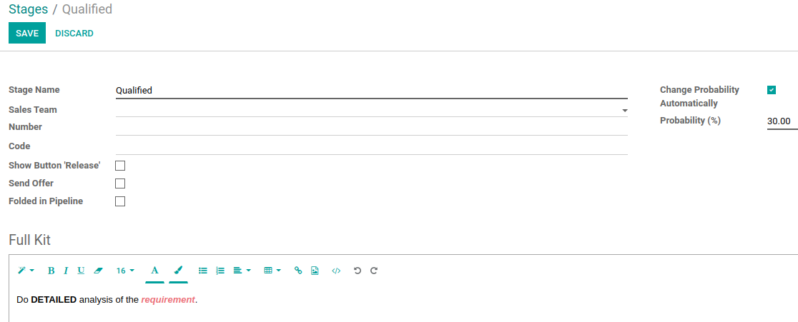
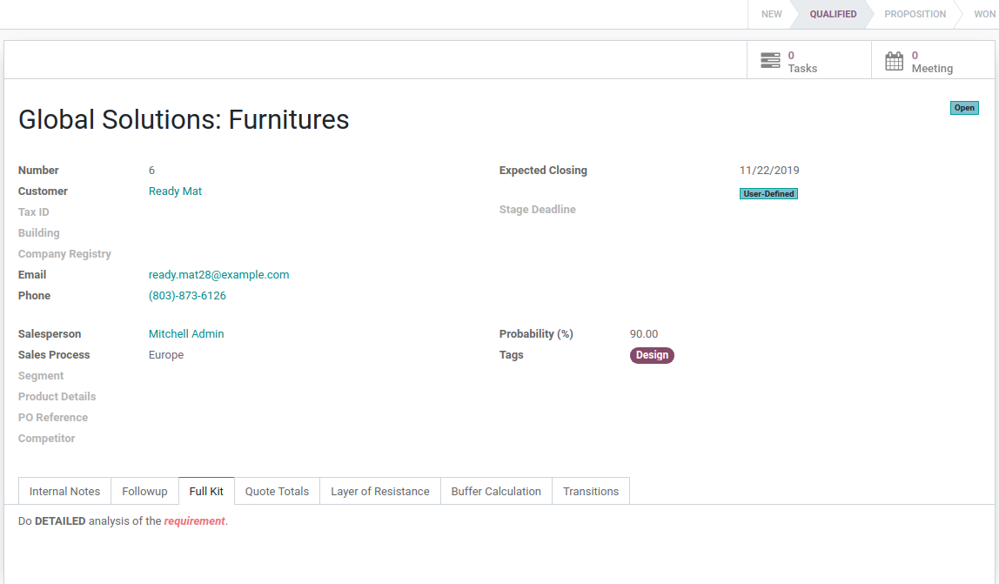

==============================
Full Kit description per stage
==============================

You can now describe stages using rich text. So it is possible to use
various formatting option (like bold, colors) or even images, links and
so on. When configured, Full Kit description will be showed for
opportunities current stage.

Configuration
=============

For this feature to work, :code:`crm_stage_requirements` must be
installed.

You will now be able to use formatting options for stage description.

Describe stage with rich formatting
===================================

Go to (make sure debug mode is enabled) :menuselection:`CRM --> Configuration --> Pipeline --> Stages`
open stage you want to edit.

Now if you open opportunity that is on stage with description, you will
see it on Full Kit tab.

