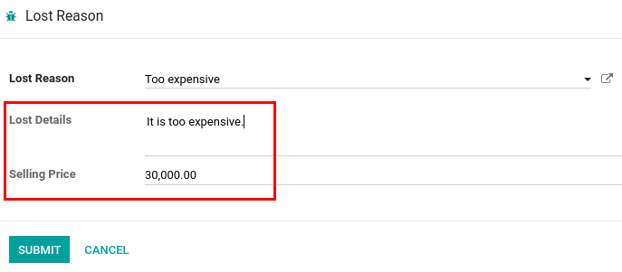
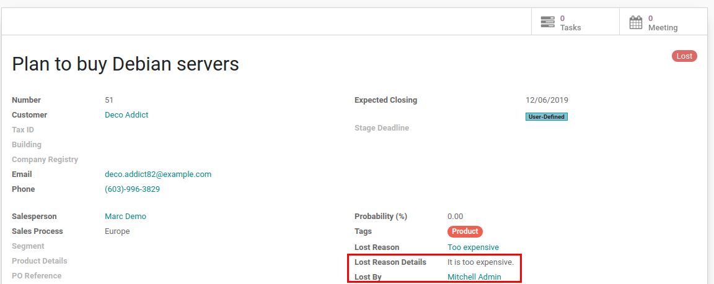

========================
Lost Reason Improvements
========================

Mark as Lost action allows to include more information about the lost.

Configuration
=============

For these features to work, module :code:`crm_lost_reason_improve` must
be installed.

Mark as lost
============

For standard behavior see :doc:`../pipeline/lost_opportunities`.

Improvements:

* *Lost Reason* is required when marking lead/opportunity as lost so it
  would be clear why it was lost.
* Use *Lost Details* field to explain lost reason better. This field
  appears on lost opportunities also.
* *Lost By* on opportunity holds the information about who set the
  lead/opportunity as lost (visible on lost opportunities only).
* *Lost Reason*, *Lost Details* and *Lost By* fields are cleared if lost
  lead/opportunity is made active again.
* *Lost Reason* wizard contains *Selling Price* to specify new lost
  revenue if it needs to be updated while doing such action.

