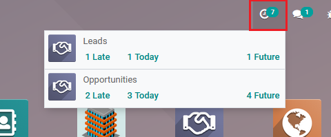

=====================================
Mail Activity Systray for CRM
=====================================

Splits Lead/Opportunity preview in systray, to show Leads and Opportunities separately. 
This allows to use action window action for each and correct views.

Standard Odoo uses generic action and default views, which actually must be different 
for leads and opportunities.

Configuration
=============

For this feature to work, module :code:`mail_activity_systray_for_crm` 
must be installed.

.. note::
    This module requires CRM App to be installed.

To enable this functionality two settings must be enabled: 
1) :menuselection:`CRM --> Configuration --> Settings` and mark 
*Leads*; 2) :menuselection:`Settings --> General Settings` and enable 
*Use 'extra' Data when Rendering Activities Systray*.

.. note::
    If no activities are scheduled for Leads or Opportunities, the section 
    with no activities will not be displayed in systray.

Functionality
=============

When module is installed and enabled, user can see Leads and 
Opportunities displayed in separate blocks in systray (clock):

Clicking on Leads or Opportunities will open all the user's
Leads or Opportunities respectively. Clicking on *Late*, 
*Today* or *Future* will open Leads/Opps window with respective 
filer applied.

.. note::
    When Leads or Opportunities window is open, creating new 
    Lead/Opp will create Lead or Opportunity - depending what view 
    is currently active.
