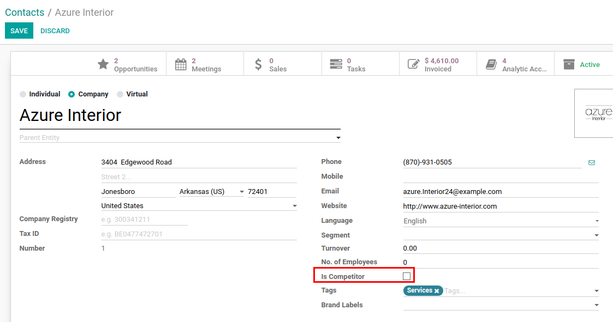
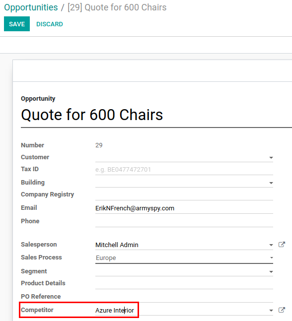

==================
Partner Competitor
==================

Possibility to assign Competitor on Leads & Opportunities.

Configuration
=============

For this feature to work, module :code:`crm_partner_competitor` must
be installed and *Show Competitors for Leads & Opportunities* in CRM
Settings must be enabled.

Create a Partner Competitor
===========================

Partner Competitor is a regular partner which has *Is Competitor*
checked.

Set a Competitor on Leads & Opportunities
=========================================

Use *Competitor* field and select a partner from a list of partners with
*Is Competitor* checked.

