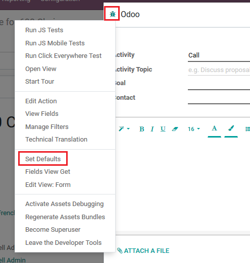
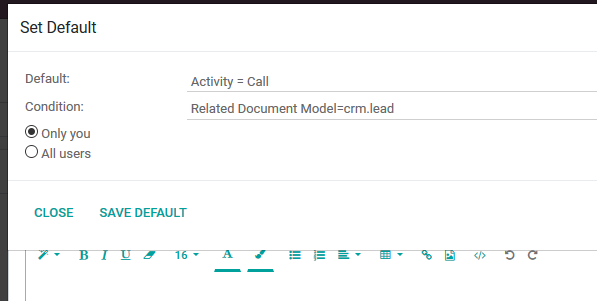

=============================
Activity Defaults
=============================

Allow to set defaults depending on Related Document Model (model name).

For this feature to work, module :code:`mail_activity_defaults` must 
be installed.

Usage
=============

Having module installed, debug mode activated, start entering activity, click on 
*bug* (*Open Developer Tools*) and open *Set Defaults*:

In *Set Default* window, select what activity type must be default (i.e. Activity = 
Call, Email, Meeting, etc.), select Condition, what is added as new functionality 
(Related Document Model = crm.lead) to limit application of this default and also 
select is this defaul applied to All users or only You:

Next time starting new activity, default one will be already selected.

