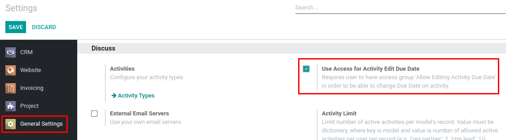
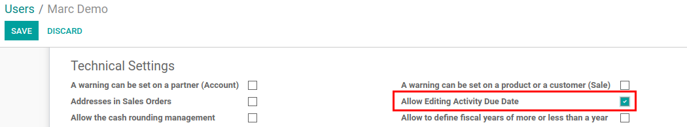

===============================
Allow Editing Activity Due Date
===============================

Specify which users are allowed to edit activity due date.

Configuration
=============

For this feature to work, :code:`mail_activity_edit_date` must be
installed and *Use Access for Activity Edit Due Date* in Discuss
section of General Settings must be enabled.

.. note::
    If used together with Calendar App, module
    :code:`mail_activity_edit_date_calendar` must be installed as well.

Edit Activity Due Date
======================

By default, with this feature enabled, all users will be disallowed to
edit due date of activity and will get an error while trying to modify
it.

User must have *Allow Editing Activity Due Date* checked to be able to
edit due date of activity.

.. note::
    User must refresh the page after configuration, so the feature
    would work properly.
