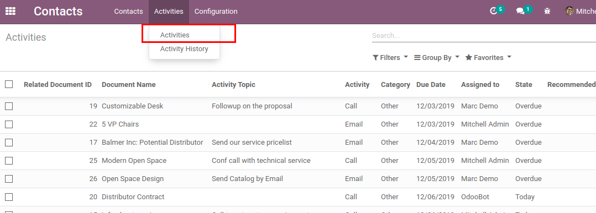
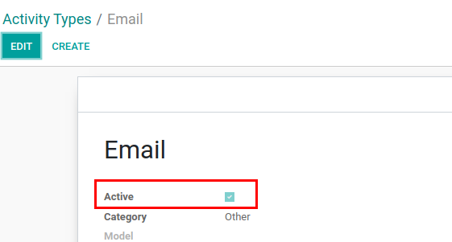

=================================================
Reach Activities via Menu, archive Activity Types
=================================================

Easy way to reach and analyze activities using a separate menu and more
friendly views. Manage which activity types allow to use by archiving
unnecessary ones.

Configuration
=============

For these features to work, :code:`mail_activity_extended` must be
installed.

Activities Menu & Views
=======================

Now activities can be reached via menu
:menuselection:`Contacts --> Activities --> Activities` and better
analyzed using custom filters in list view.

.. seealso:: :doc:`mail_activity_history`

Archive Activity Type
=====================

Activity type now includes additional field *Active* which allows to
archive/unarchive certain activity types and so manage which activity
type allow to use.

