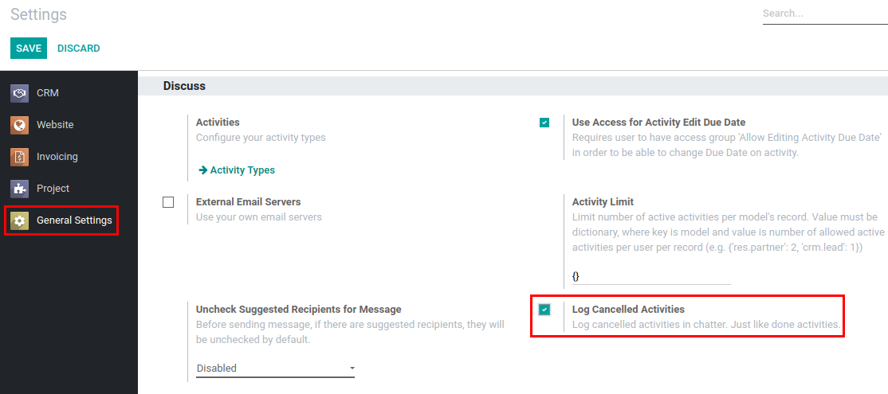
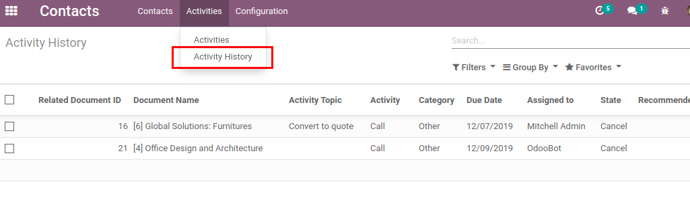

=====================
History of Activities
=====================

Save done and cancelled activities in history table for later analysis.

Configuration
=============

For these features to work, module :code:`mail_activity_history` must be
installed.

.. note::
    In multi-company environment, module
    :code:`mail_activity_history_multicompany` should be installed, so
    users could access only global or user's company history.

Log Cancelled Activity
======================

Optionally, it might be configured to log cancelled activities in the
chatter, just like done activities. To activate this feature,
*Log Cancelled Activities* in Discuss section of General Settings must
be enabled.

With this option enabled, cancelled activity will not disappear (as in
standard Odoo behavior) and will be logged in the chatter.

.. image:: media/activity_history_cancel.png
    :align: center

Analyze History of Activities
=============================

History of done or cancelled activities can be reached via menu
:menuselection:`Contacts --> Activities --> Activity History` and
analyzed using custom filters in list view.

.. seealso:: :doc:`mail_activity_extended`
