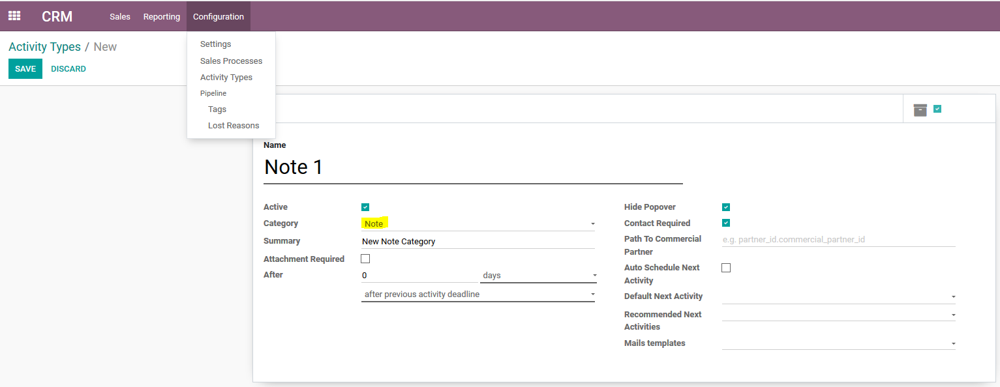
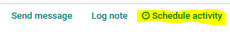
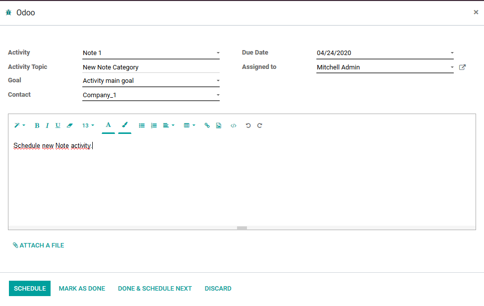
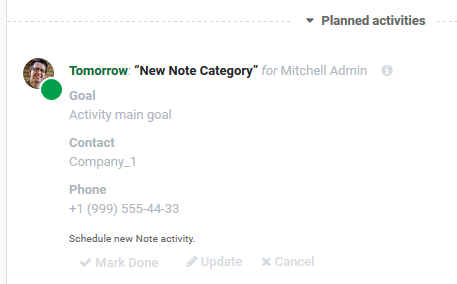
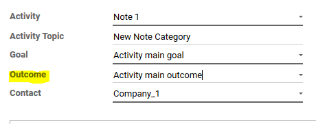
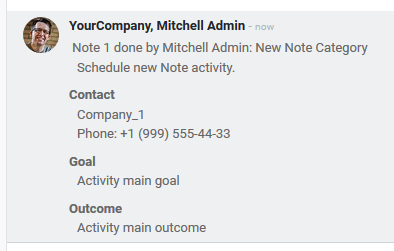
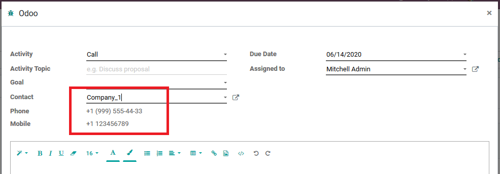
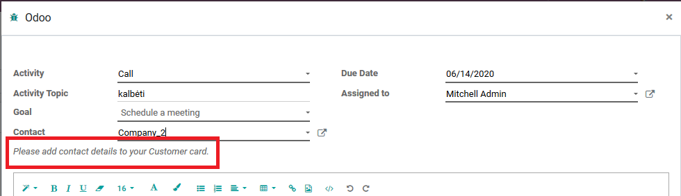

================
Note Activities
================

New activity type called *Note* added next to currently 
available generic *Other* type and *Meeting* (that allows 
to create meeting from activity).

If you select *Note* category on your activity type (most likely 
on Call activity type), it will behave as a goal activity, where you 
will need to select goal and contact. 

Configuration
=============

To start using this new activity category, module :code:`mail_activity_note`
must be installed and *Note* activity type added.

To add this new activity type, go to :menuselection:`CRM --> Configuration --> Activity Types`
and create  new activity type with category *Note*:

Contact can be made mandatory on activity type, by checking *Contact required* option. 
If not checked, it will be optional.

*Hide popover* is always mandatory for this type. This depends on 
module :code:`mail_activity_popover_toggle` that allows to hide 
little activity popup form - see more: :doc:`mail_activity_popover_toggle`. 
When *Note* category is chosen, by default, it will select that option. 
If User force unselects it when *Note* category is chosen, constraint will 
prevent from saving such changes.

On activity type, one can specify partner field, so it would be possible to 
know how to filter contacts on activity - *Path To Commercial Partner* field is used 
for this purpose - add *partner_id.commercial_partner_id* in this field to 
filter partner contacts on activity.

.. note::
    Don't forget to save changes to your new activity type! - to start using it.

Note Type Activity Functionality
================================

Schedule and activity for CRM, Contacts, Sales, Project or any other Odoo object. Click 
on *Schedule activity*:

Fill in all the required fields in the window, what opens:

Click *Schedule* to save activity and new *Note* category activity is planned:

.. note::
    Activity template is updated, so after scheduling activity, it would show *Note* 
    extra information: goal, contact, contact phone and contact mobile phone (if phone 
    or mobile phone is not set on selected contact, label will be hidden to not pollute 
    view).

    Goal and Contact is made visible in main area - without a need to click on Info button.

When finishing *Note* type activity, activity pop up will be displayed - it will show new 
mandatory drop down field *Outcome*:

.. note::
    Outcome and goal values can be specified via activity menu (see in admin settings - 
    :menuselection:`Settings --> Technical --> Activity Goals` and 
    :menuselection:`Settings --> Technical --> Activity Outcomes`).
    It is also possible to limit for which activity type specific outcome/goal can 
    be used. By default, every activity with Note type can use it. If activity types 
    are specified on goal/outcome records, it will be available only for those types.

After activity is done, Note is created in *Chatter* with extra info: contact, goal 
and outcome:

.. note::
    Please note, that outcome and goal values can be translated - multilanguage is added.

Phones of the contact 
======================

When a contact is selected in the Note activity, phone and mobile phone is 
displayed below the contact:

In the case the contact has no any phone entered, a message *Please 
add contact details to you Customer card* will be displayed:

Analyze Note Activities and History
===================================

With Notes functionality, additional fields will be displayed 
in tree views (in Activities - Goal and in History - Goal, 
Outcome) but :code:`mail_activity_history_note` 
module must be installed for this. 

.. seealso::

    :doc:`mail_activity_extended`

    :doc:`mail_activity_history`
