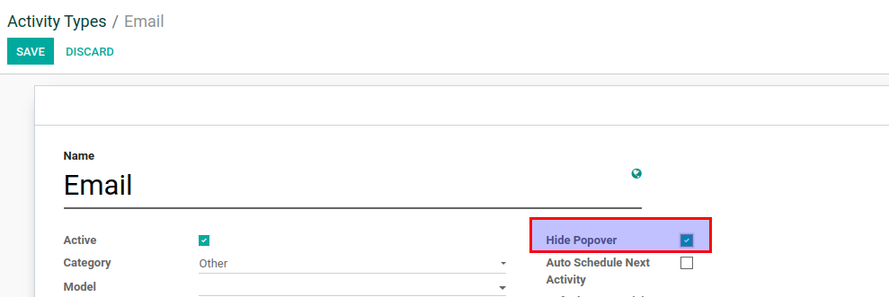
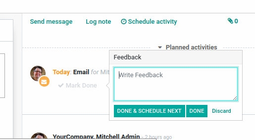
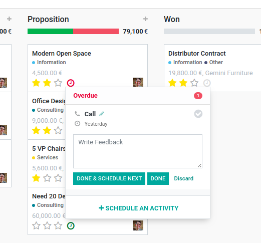
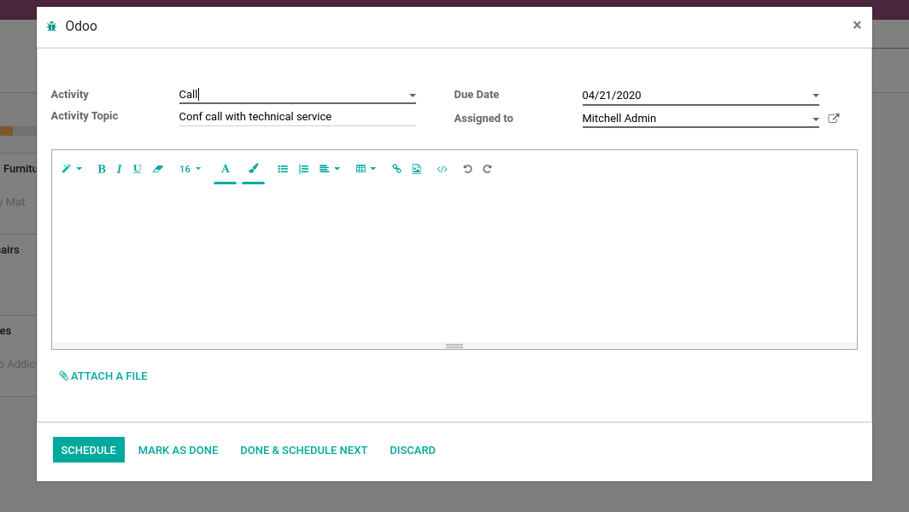
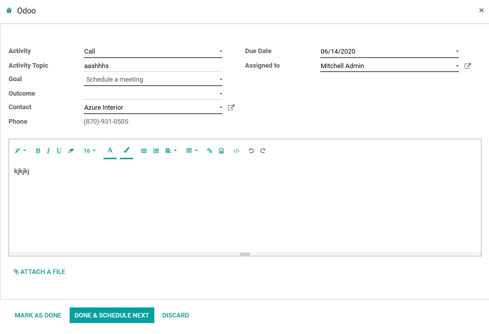
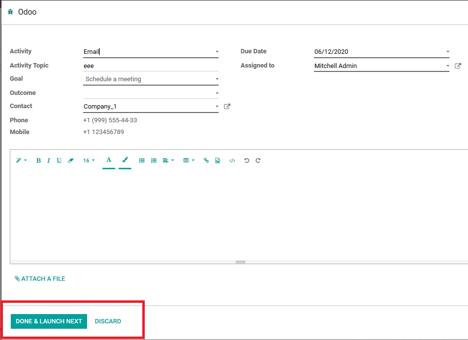

===========================================
Activity Popover depending on Activity Type
===========================================

Manage which popover to display when clicked ``'Mark Done'`` on
activity.

Configuration
=============

For this feature to work, module :code:`mail_activity_popover_toggle`
must be installed and *Hide Popover* enabled/disabled on activity type.

Mark Done Popover
=================

As standard, there are two available popovers to use when marking
activity as done:

* smaller feedback popover:

* bigger universal (used for multiple purposes) popover:

When *Hide Popover* is enabled on activity type - bigger popover will
be showed instead of the smaller one, when marking activity, with such
activity type, as done.

.. note::
    You can mark activity as done via chatter or kanban view, e.g.:

    .. image:: media/activity_popover_toggle_mark_done_chatter.png
        :align: center

    .. image:: media/activity_popover_toggle_mark_done_kanban.png
        :align: center

Hidden *Schedule* button
========================

When activity is planned and user wants to *Mark done* it, 
in the window, what pops-up, there will not be *Schedule* button, - 
instead it will be *Done & Schedule Next*, *Mark As Done* or *Discard* only 
and *Done & Schedule Next* will be selected by default:

In the case *Auto Schedule Next Activity* is marked in Activity Type, 
hitting *Mark done* will pop-up a window with *Done & Launch Next* or 
*Discard* selections only:

If the user hit *Edit* or start a new activity, all the standard action buttons 
will be displayed for the user at the bottom of the window.
