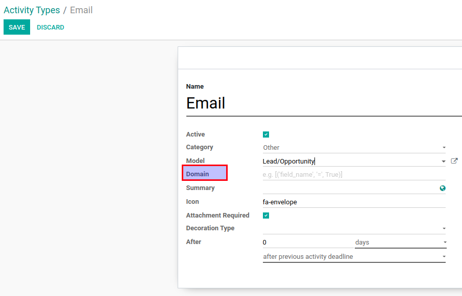

==============================================
Use Different Activity Types on the Same Model
==============================================

Define on which model's records specifically, certain activity types
should be used.

Configuration
=============

For this feature to work, module :code:`mail_activity_type_domain` must
be installed and *Domain* field filled according your needs.

.. note::
    Field *Domain* is visible only when *Model* is selected.

How does Domain work?
=====================

*Model* and *Domain* on activity types are used to filter all available
activity types when creating/updating an activity on a certain record.
*Model* filters specific model and *Domain* - specific model's records.

For example, if we set 'Lead/Opportunity' as *Model* and
:code:`[('type', '=', 'opportunity')]` as *Domain* on activity type, it
means that such activity type will appear in the list of available
activity types while creating/updating an activity on opportunities
only.
