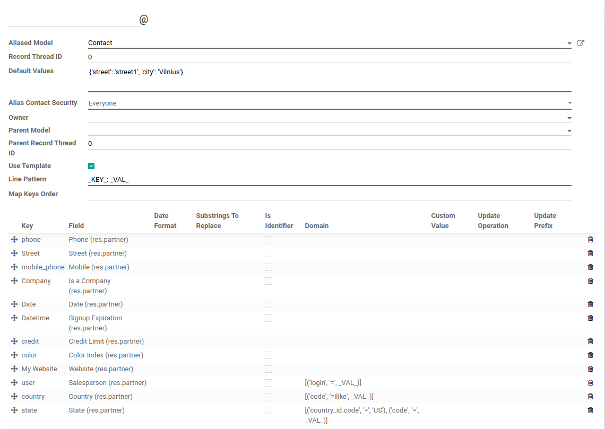
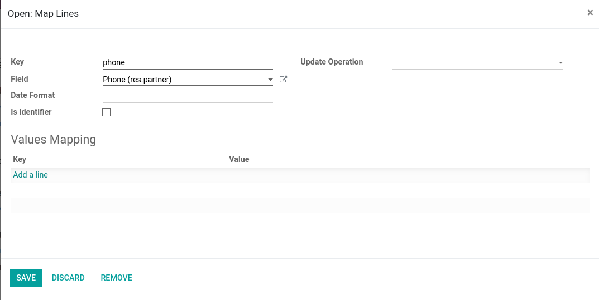
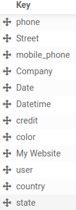

======================================
Email Parsing via Mail Alias Templates
======================================

Configure mail alias template to be able to parse email content that is used to create and update related records.

Configuration
=============

To be able to use mail alias templates, :code:`mail_alias_template` module must be installed first.

Then can open or create wanted mail alias (in :menuselection:`Settings --> Technical --> Email --> Aliases`). To be able to use template, check :code:`Use Template` option.

First need to specify :code:`Line Pattern`. Here special placeholders :code:`_KEY_` and :code:`_VAL_` must be specified on this field. These placeholders are used to know where to expect key and value when parsing email message. Line Pattern Also consists of optional Prefix (that goes before key/value pair) and suffix (that goes after key/value pair) and mandatory separator (that indicates how to distinguish key from value).

If Prefix and Suffix would be used, pattern example could be: :code:`[_KEY_] {_VAL_}`, where :code:`[` would be prefix, :code:`] {` would be separator and :code:`}` would be suffix.

Second thing that is needed - to add actual mapping lines. On :code:`Key` field specify key that is expected to be found on email message and on :code:`Field` field specify to which field map parsed value from message.

Map Line Options
================

Update record with another email message
^^^^^^^^^^^^^^^^^^^^^^^^^^^^^^^^^^^^^^^^

Related record update can be done in two ways:

* Replying to existing message that was sent from Odoo or message that has a special Message-ID header that Odoo uses in order to identify related record.
* Using one of the keys as identifier by checking :code:`Is Identifier` option. When message is parsed and if it finds key with this option, it will search another message that has same identifier. If it finds one, it will use that message's related record for update instead of creating new record.

Update Operation
^^^^^^^^^^^^^^^^

If there are multiple keys that need to update a single field on Odoo side, Update operation offers few options how to handle it:

* Concatenate: concatenate two or more values into one. If field is of string type, can also use :code:`Update Prefix`, where you can separate values. For example by empty space or newline. Prefix must be entered between quotes.
* No Overwriting: with this option, if multiple keys try to update same field, only the first one will be applied. Others, will be ignored.

Date Format
^^^^^^^^^^^

If mail message is expected to provide dates and date format is different
than Odoo's format, it is possible to specify what kind of format email message date has, so it could be converted to the one Odoo understands. For formatting details, check field's help description.

Values Mapping
^^^^^^^^^^^^^^

Can use this if parsed values on message must be translated to different values on Odoo side. For example we have key/value pair :code:`State: completed`, but on Odoo side, we want to translate such value to :code:`done`. So we add new values mapping where :code:`Key` is :code:`completed` and Value :code:`done`.

Values Search
^^^^^^^^^^^^^

If we need to get related record (Many2one field) database ID, but parsed message can't provide such information, it is possible to use parsed values in search to find actual database ID. For example, if we need to set Salesperson on partner and we only know user's login, but not his ID, we can use such domain: :code:`[('login', '_VAL_')]`, where :code:`_VAL_` is value parsed on message line (in this case it would be user login).

Map Keys & Map Lines Order
==========================

On :code:`Map Keys Order` field, can specify order of keys in which to parse email message lines. For example if we have this message:

.. code-block:: language

    City: Vilnius
    Country Code: LT
    Street: My Street

If no :code:`Map Keys Order` is provided, default order will be as if seen on message: City, Country, Street.

We can change that order, if we specify for example :code:`Street, City, Country`. Order must be list of keys separated by commas. It is also possible to not specify all keys that are used, but only those that have priority to be ordered. If for example we would specify order as :code:`Street, City`, lines would be ordered as follows: Street, City, Country. All not specified keys' lines will be put after ordered lines.

It is also possible to change order where each mapping is applied on message line that is being parsed. Just need to click on :code:`Plus` sign and drag up or down:

Changing order can have impact on parsing and setting specific values. For example, it might be important to give priority for one value over other (if let say multiple map lines set same value on record that is created or updated).

Other Specifics
===============

When mail alias template is used and incoming email is fetched for that alias, both email subject and body are parsed. It means, key/value pair can also be included on subject if needed.

Standard :code:`Default Values` field is used as fallback, if some mapped key was not found on email message. For example, if we configure template to look for :code:`Street` key that is mapped with field named :code:`street`, but no such key is found on email and we also have default values specified as :code:`{'street': 'My Default Street'}`, when creating new record, it will use that default street value.

Videos
======

Introduction
^^^^^^^^^^^^

.. youtube:: d6NW8CQoJTY
    :align: right
    :width: 700
    :height: 394

Line Pattern and Fields Mapping Configuration
^^^^^^^^^^^^^^^^^^^^^^^^^^^^^^^^^^^^^^^^^^^^^

.. youtube:: F6Zx7u-scQI
    :align: right
    :width: 700
    :height: 394

Use Parsed Message Value to Find Related Odoo Record
^^^^^^^^^^^^^^^^^^^^^^^^^^^^^^^^^^^^^^^^^^^^^^^^^^^^

.. youtube:: DfeEn8-TtqA
    :align: right
    :width: 700
    :height: 394

Use Value Mapping to Translate Parsed Value Into New One
^^^^^^^^^^^^^^^^^^^^^^^^^^^^^^^^^^^^^^^^^^^^^^^^^^^^^^^^

.. youtube:: ZgL2hviDyDM
    :align: right
    :width: 700
    :height: 394

Update Related Record Using Key as Identifier
^^^^^^^^^^^^^^^^^^^^^^^^^^^^^^^^^^^^^^^^^^^^^

.. youtube:: yn7JWfYh-Os
    :align: right
    :width: 700
    :height: 394
