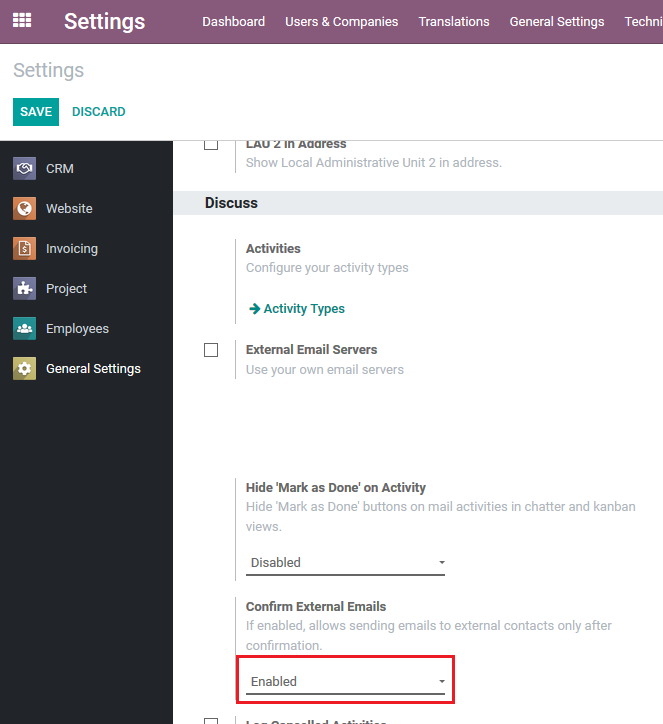
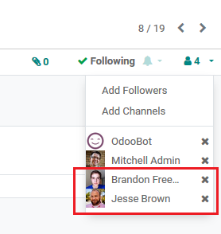
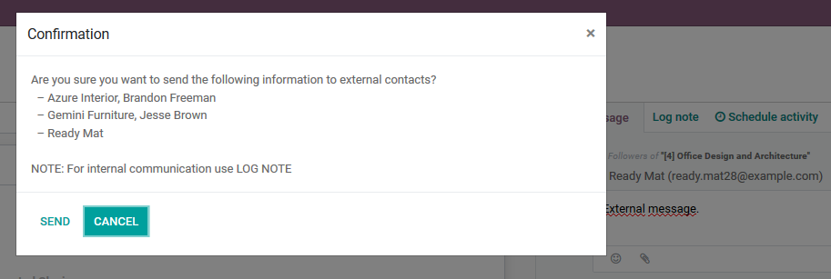
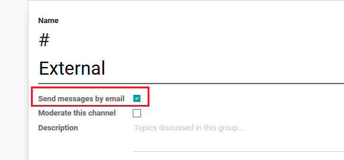

===========================================================
Confirmation on sending out messages to external recipients
===========================================================

Adding extra confirmation step while sending emails to external 
recipients (partners, followers). This is included in the chatter 
and advanced mail message composition wizard. Confirmation popover 
will appear if email is going to be sent to any of external partners 
with a list of external recipients.

Configuration
=============

To start using this new functionality, module :code:`mail_external_confirm`
must be installed.

Feature can be enabled/disabled in General Settings 
(:menuselection:`Settings --> General Settings --> Discuss`), Discuss 
section by changing value of parameter 'Confirm External Emails':

Functionality
=============

This feature warns the user, that the message he/she is intended to send 
contains any type of external recipients. It works in *Send Message*, 
*Log Note* with @ or *Channels*. 

This feature is active with *Leads*, *Opportunities* in CRM module and 
*Partners* in Contacts module. 

Add external followers of the lead, opportunity or partner:

Try sending message and you will get a pop-up to confirm sending 
with listed all external recipients:

.. note::
    Confirmation in pop-up by default will have *Cancel* selection.

Channel with external recipients will be trigered, when in channel 
configuration *Send messages by email* is marked:

