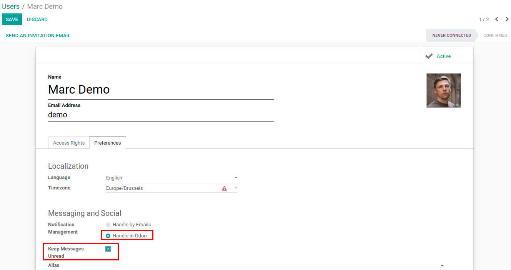
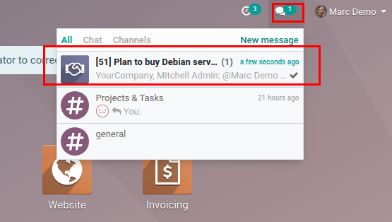
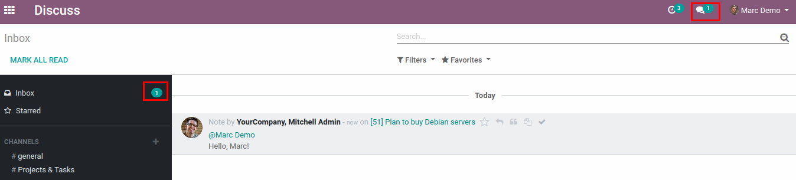

====================================
Keep Message Unread if it Was Opened
====================================

Keep Odoo message as unread until it is marked as read manually.

Configuration
=============

For this feature to work, :code:`mail_message_keep_unread` must be
installed and option *Keep Message Unread* must be checked for user.

.. note::
    This option is only relevant for users that notifications management
    is handled in Odoo and not by Emails.

.. note::
    User must refresh the page after configuration, so the feature
    would work properly.

Mark Message as Read Manually
=============================

With this feature enabled, messages handled in Odoo will be kept unread
after opening it (standard Odoo behavior is to mark message as read
automatically when it is opened). Message will remain in the
conversations and discuss page until it is marked as read manually.

