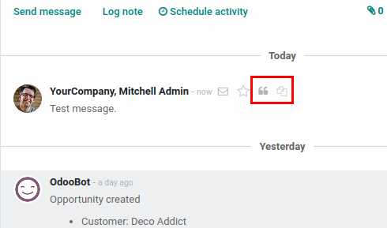
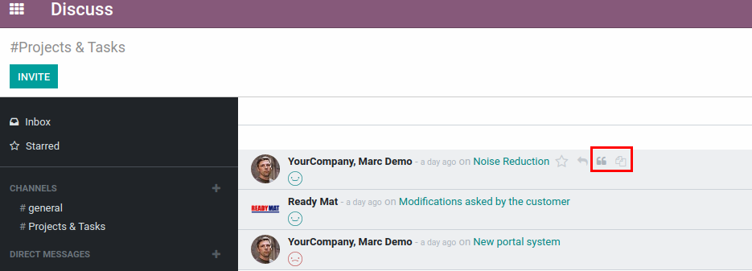
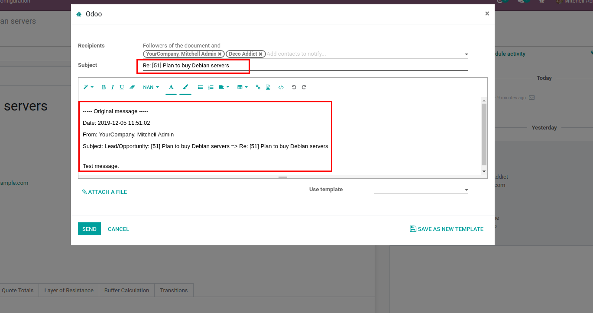

=======================
Message Quote & Forward
=======================

Easy way to Quote or Forward messages from Mail Chatter or Discuss page.

Configuration
=============

For this feature to work, :code:`mail_message_reply` must be installed.

Quote & Forward
===============

Quote & Forward icons appears in the Chatter and Discuss page when mouse
pointer is hovered over a certain message.

Click on corresponding icon to Quote or Forward message and an email
composer will be popped up. By default, message will include data from
the original message and subject will have prefix depending on reply
type.

