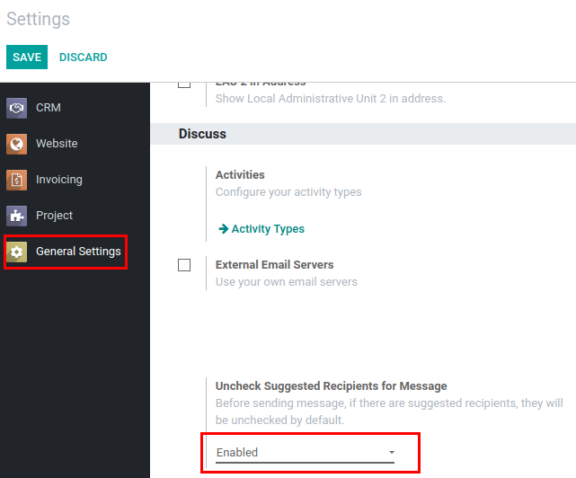
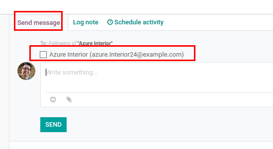

===============================
Mail Suggested Partners Uncheck
===============================

Before sending a message, if there are suggested recipients, they will
be unchecked by default.

Configuration
=============

For this feature to work, :code:`mail_suggested_partners_uncheck` must
be installed and *Uncheck Suggested Recipients for Message* in Discuss
section of General Settings must be enabled.

Send Message
============

By default, recipients are unchecked while composing a new message.

