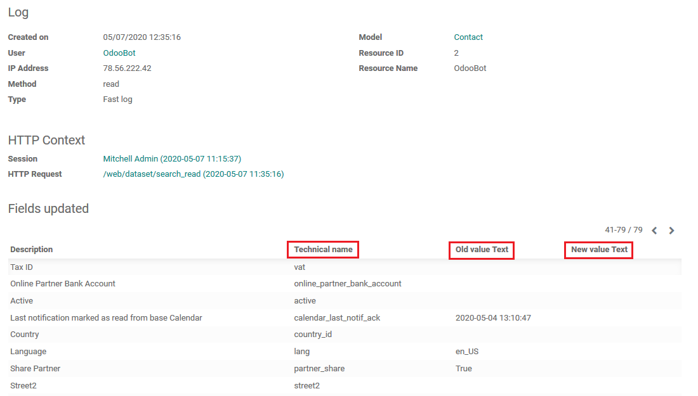

=================================
Audit Log Search new capabilities 
=================================

Enhanced search capabilities added to *Audit Log Search*.
    
Configuration
=============

To start using this new functionality, module :code:`auditlog_search`
must be installed.

At least one *Audit Rule* must be created and subscribed in 
:menuselection:`Settings --> Technical --> Audit --> Rules`:

Also some changes in the system must be executed to see and 
start searching entries in the log.

.. note::
    Audit Log also contains IP address, what is feature of 
    module :code:`auditlog_track_ip` - please see it in the 
    picture below.

Audit Log Search Functionality
==============================

To see the log, go to :menuselection:`Settings --> Technical --> Audit --> Logs`:

Using the Search on the top of the page, you can search 
through the log entries. Module :code:`auditlog_search` 
adds extra search capabilities: technical value of *Old/New Value Text* 
and *Technical Field Name* can be searched from log records:

And it allows searching for any values in *Technical name*, 
*Old value Text* and *New value Text* fields:

.. note::
    While searching for *Old/New value Text* you have to know 
    and use technical values of those fields, like Salesperson 
    change from *Mark* to *Jane* is value *5* change to *2*, 
    what are user_id's for those Salespersons, when *Fast log* 
    is enabled - please see picture below.

.. image:: media/auditlog_userid.png
    :align: center

In the case *Full log* is enabled, *Old/New value Text* will 
have both technical values (id's) and normal values in the log:

