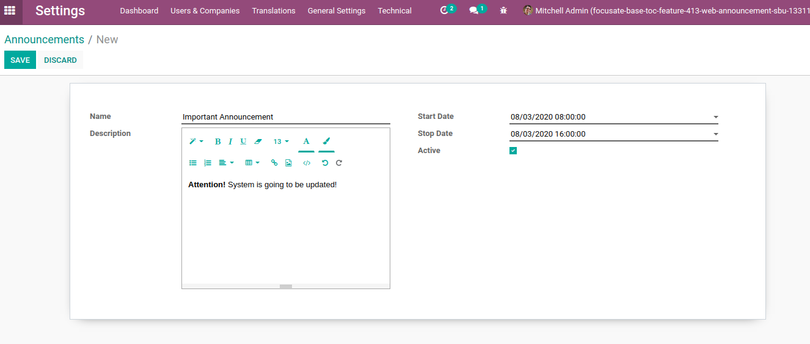
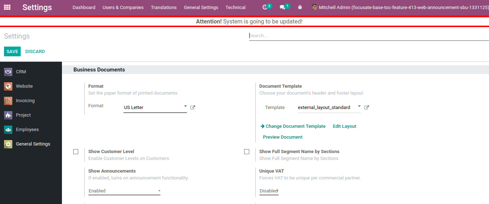
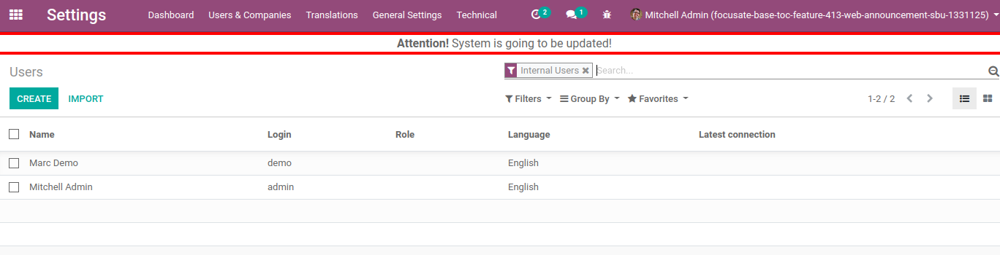

=============
Announcements
=============

Manage announcements which will be displayed in all views for a certain
amount of time.

Configuration
=============

To start using this functionality, module :code:`web_announcement`
must be installed and *Show Announcements* in General Settings must be
enabled.

Announcement Functionality
==========================

To create a new announcement, go to
:menuselection:`Settings --> Technical --> Automation --> Announcements`
and fill in required fields by your needs:

.. note::
    Do not forget to enable certain announcement by checking *Active*
    field, because only active announcements are going to be displayed
    for selected period of time.

.. note::
    User's timezone in user preferences must match his browsers' timezone,
    to prevent inaccuracies while displaying announcements.

.. note::
    Announcements are refreshed with page refresh only and if there is
    an active announcement and current time is included in announcement's
    time range, announcement will be displayed until announcement's
    *Stop Date*.

Active announcement appears in all views, e.g.:

.. image:: media/web_announcement_view3.png
    :align: center
