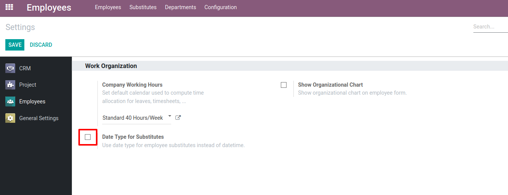
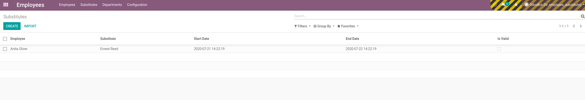
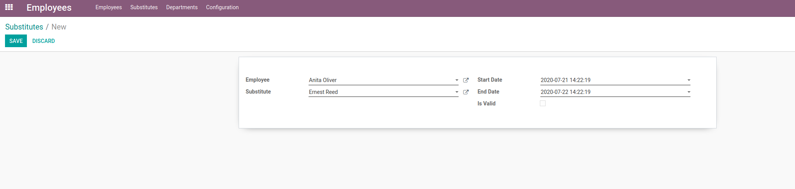
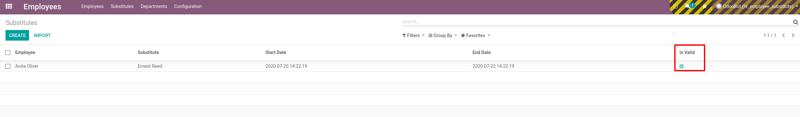
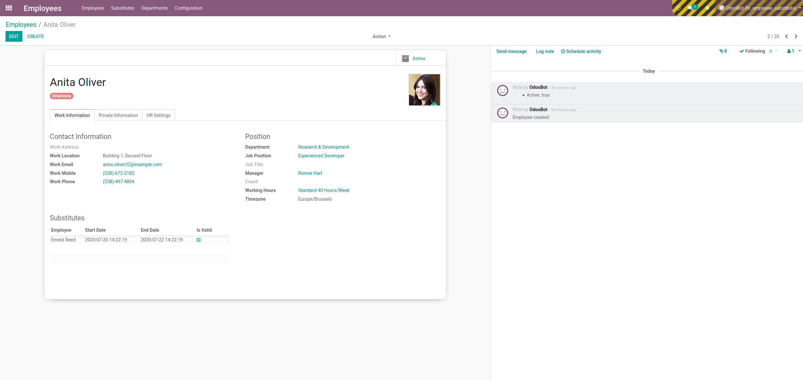

===================
Employee Substitute
===================

Allows to specify substitute employees for other employee and select specific
date range, when substitution will be valid.

Configuration
=============

To start using this new functionality, module :code:`hr_employee_substitute`
must be installed.

By default datetime type is used for start/end of substitute, but it is
possible to simplify it and use date type, by checking Date Type for
Substitutes. This option can be enabled in Employees Settings
(:menuselection:`Employees --> Configuration --> Settings`), Under Work
Organization section checking 'Date Type for Substitutes' option:

Moreover there is a scheduler which by default runs every hour to check
if validity of substitutes need to be updated.
Schedulers can be enabled/disabled on (:menuselection:`Settings --> Technical --> Scheduled Actions`)

.. note::
    By default substitutes scheduler is enabled once module is installed

Functionality
=============

This feature allows to specify substitute employees for other employee and
select specific date range, when substitution will be valid.

In order to view and create employee substitutes, navigate to
(:menuselection:`Employees --> Substitutes`)

Here you can see all substitutes in a tree view:

In order to create substitutes, choose employee, substitute and start/end date
and click save button:

Employee substitute become's valid automatically once it reaches today's date:

Additionally substitutes can be viewed/created directly from Employees app.

